# PostCSS-LostGrid

If you have cloned this repository, then make sure to install the dependancies:
```
$ npm install
```

If you'd like to set up ```PostCSS``` and ```LostGrid``` in a new repository or would just like to know how all this works, continue reading.


## Install Gulp
### What is [Gulp](https://www.npmjs.com/package/gulp)?

Gulp is a task/build runner for development. It allows you to do a lot of stuff within your development workflow.

**Automation**
 - gulp is a toolkit that helps you automate painful or time-consuming tasks in your development workflow.

**Platform-agnostic**
- Integrations are built into all major IDEs and people are using gulp with PHP, .NET, Node.js, Java, and other platforms.

**Strong Ecosystem**
 - Use npm modules to do anything you want + over 2000 curated plugins for streaming file transformations

**Simple**
 - By providing only a minimal API surface, gulp is easy to learn and simple to use


### To Install:
If you haven't used ```gulp``` before, make sure to:
```
$ sudo npm install gulp -g
```

then:
```
$ npm install gulp
```


### Project file structure

Add a ```gulpfile.js``` to your working directory:
```
$ touch gulpfile.js
```

Add another folder called *dest* to the working directory and add a *styles.css* file to the new folder.

 *Make sure to back out into the working directory after adding the files so as to avoid workflow confusion*
```
$ mkdir dest
$ cd dest
$ touch styles.css
$ cd ..
```


*Your file structure should look something like this to start with:*


## Implement Gulp

### *gulpfile.js*
```js
var gulp = require('gulp');

gulp.task('styles', function() {
  return gulp.src('styles.css')
    .pipe(gulp.dest('dest/styles.css'));
});

gulp.task('watch:styles', function(){
  gulp.watch('**/*.css', ['styles']);
});
```
1. We have to require ```gulp``` since it is what we are using for a build runner in this project.
    * PostCSS offers alternative runners in their [Github repository](https://github.com/postcss/postcss) if you would like to use something other than ```gulp```


2. Indicate that *styles.css* (in the main directory) will be the source for the runner to compile . Then, the compiled file will be sent to the *styles.css* file within the 'destination' folder *dest*.

3. If you are familar with Sass, then you have seen this ```watch``` before. We give ```gulp``` the ```task``` to ```watch``` our CSS files and when we make changes to them, ```gulp``` will see them and compile for us.


## Install and Require PostCSS

### Install gulp-postcss
[PostCSS gulp plugin](https://github.com/postcss/gulp-postcss) is used to pipe CSS through several plugins, but parse CSS only once.
```
$ npm install --save-dev gulp-postcss
```
*this will be added to our packages file and to our project*

### *gulpfile.js*

Require this package just like any other:
```js
var postcss = require('gulp-postcss')
```

## Using PostCSS

### *gulpfile.js*
```js
gulp.task('styles', function() {
  return gulp.src('styles.css')
    .pipe(postcss());
    .pipe(gulp.dest('dest/styles.css'));
});
```
Now we can go ahead and use the PostCSS processesor in our ```gulp.task```. *It is considered a function, hence the parentheses*

The way PostCSS works, it requires you to have additional processors
 * I am using [autoprefixer](https://www.npmjs.com/package/autoprefixer) which is plugin to parse CSS and add vendor prefixes to CSS
  * Autoprefixer supports the unit function (calc()), which will be important when we introduce ```LostGrid```

```
$ npm install --save-dev autoprefixer-core
```

- require the additional processesor
```js
var autoprefixer = require('autoprefixer')
```

- within ```gulp.task```, define a variable that will hold all of the processesors and pass that variable into the ```postcss()``` function.

```js
gulp.task('styles', function() {
  var processesors = [
    autoprefixer
  ]
  return gulp.src('styles.css')
    .pipe(postcss(processesors))
    .pipe(gulp.dest('dest/styles.css'));
});

gulp.task('watch:styles', function(){
  gulp.watch('**/*.css', ['styles']);
});
```

### Browsers and Autoprefixer
You can specify the browsers you want to target in your project by passing the version as a string in an array via an object and a function when you declare ```autoprefixer()``` inside ```var processors```

```js
var processesors = [
  autoprefixer({browsers: ['last 2 version']})
]
```

Now we have ```autoprefixer``` looking for only the last two versions of the most recent browsers.

### *styles.css*
To test that everything is connected and correctly formatted, add some basic styling to the *styles.css* file in the main directory.

```css
body {
  background: red;
  display: flex;
}
```

From your command line, use ```gulp``` to 'watch' for when you are working in the *styles.css* file and ```autoprefixer``` will prefix your style properties into the *styles.css* in your *dest* folder.
```
$ gulp watch:styles
```

***dest/styles.css***

Prefixed ```flexbox``` for various web-kit and Microsoft prefixes:
```css
body {
  background: red;
  display: -webkit-box;
  display: -ms-flexbox;
  display: flex;
}
```

## Get Lost
[LostGrid](https://github.com/peterramsing/lost) is based on ```(calc())``` and also offers some FlexBox Grid features as well.

*LostGrid was created by Cory Simmons*

### Installing Lost
LostGrid is in PostCSS because PostCSS is more flexible than others like Sass or Stylus.
```
$ npm install --save-dev lost
```

## *gulpfile.js*

Require ```lost``` and add it to your ```var processors```
```js
var gulp = require('gulp');
var postcss = require('gulp-postcss')
var autoprefixer = require('autoprefixer')
var lost = require('lost')

gulp.task('styles', function() {
  var processors = [
    lost,
    autoprefixer({browsers: ['last 2 version']})
  ]
  return gulp.src('styles.css')
      .pipe(postcss(processors))
      .pipe(gulp.dest('./dest'));
});

gulp.task('watch:styles', function(){
  gulp.watch('**/*.css', ['styles']);
});
```

And now we used be able to start using ```lost```

## 'lost-column'

Start up gulp:
```
$ gulp watch:styles
```

***styles.css***

Add ```lost-column``` as a property to a ```div```
```js
body {
  background: red;
  display: flex;
}

div {
  lost-column: 1/2;
}
```

This says we want each of these columns to be 1/2 the width of its parent.

***dest/styles.css***

LostGrid uses ```(calc())``` to generate values.

*[styles.css on right && dest.styles.css on left]*


The properties ```LostGrid``` generates for the children is dependant on the 'cycle' the user implements.

* By default, ```Lost``` uses the denominator of ```lost-column``` to grab the nth-child , basically saying every other ```div``` give it ```margin-right: 0```.
  * if ```lost-column = 1/3```:
    * then you'd want each item to take up a third of it's parent's width
    * so there would be three items per row
    * so then you would want the third item to have ```margin-right: 0```


In CSS Grid, you have to define the parameters of the grid within the parent and if your math or structure is a little off it won't work. Since LostGrid uses (calc()), it automatically organizes the grid for you and you only need to alter the ```lost-column``` denominator and the relationship of the parent to the children.


## Building a Basic Grid  

Add an *index.html* with some structure like below to your main directory:
```html
<!DOCTYPE html>
<html>
  <head>
    <meta charset="utf-8">
    <title>PostCSS-LostGrid</title>
    <link rel="stylesheet" href="/dest/styles.css">
  </head>
  <body>
    <section class="grid-one">
      <div class="grid-item"></div>
      <div class="grid-item"></div>
      <div class="grid-item"></div>
      <div class="grid-item"></div>
      <div class="grid-item"></div>
    </section>
  </body>
</html>
```

In you *styles.css* :
  * add a height and a background color to your ```.grid-item```
    * and add ```margin-bottom: 20px;``` so the children are squashed together
  * ```.grid-one``` is the section container for this grid.
    * add the ```lost-utility: clear-fix;``` and ```width: 100%;``` to it.
  * ```.grid-one div``` will be looking for any 'divs' inside of ```grid-one```
    * add ```lost-column: 1/2;```

    *make sure to run ```$ gulp watch:styles``` to compile your CSS into the dest folder*

So when we run this (using ```$ lite-server``` or ```$ open index.html```) we should see 3 rows each with two of these grid-items and the last with one grid-item (all with the background color)


*You can see how the first child in each row has a gutter and the second one does not*

If we change ```lost-column: 1/2``` to ```lost-column: 1/4```:

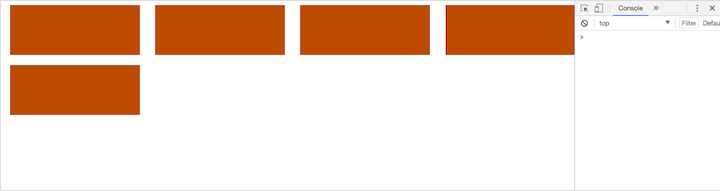

*1/4 indicates the last child in the cycle is now the fourth, so each row now has four children*
  * *The gutters are on the first, second and third child while the fourth child has a margin of zero*  
  * *All of this is automatically compiled and you only had to change one number*

## Adding more complexity to the grid

***index.html***

Add two nested grid items to one of the grid-items:
```html
<div class="grid-item">
  <div class="nested-grid-item"></div>
  <div class="nested-grid-item"></div>
</div>
```

And give ```.nested-grid-item``` a background color in your working *styles.css* as well as a height and margin-bottom property less than their parent.

*run ```$gulp watch:styles``` and ```$ lite-server``` || ```open index.html```*

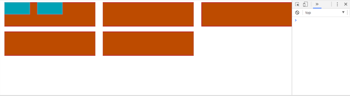

```css
.grid-one div {
  lost-column: 1/3;
}
```

This is saying that any child of ```grid-1``` thats a ```div```, apply this ```lost-column: 1/3;``` to it
  * the nested-items take up 1/3 of the parent so, together, they take up 1/3 + 1/3 = 2/6 || 1/3 of their parent


### Manipulating the Cycle

You can manually manipulate the cycle of the children by adding the desired length

  ```
  lost-column: 1/3 2;
  ```

  * the last child will now be every second one.


## Making the Grid responsive

We will be designing a grid that increases or decreases the number of columns depending on the width; in other words, a responsive grid.

***styles.css***

```css
.grid-one div {
  lost-column: 1/1;
}
 ```

*Make the default amount of columns 1*

Make your grid responsive using regualr media queries

```css
@media (min-width: 400px){
  .grid-one div {
    lost-column: 1/2;
  }
}

@media (min-width: 900px){
  .grid-one div {
    lost-column: 1/3;
  }
}

@media (min-width: 1100px){
  .grid-one div {
    lost-column: 1/4 4 50px;
  }
}
```
*The grid at less than 400px*<br>
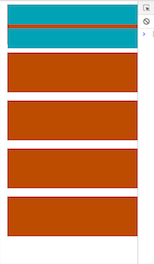

*The grid at 400px*<br>
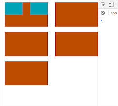


*The grid at 900px*
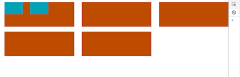


*The grid at 1100px and up*<br>
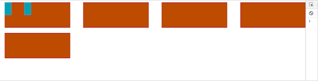


*We easily added a gutter of 50px to this one, with a cycle of 4*

As you can see, it is very easy to make your grid responsive by only including one line of code in you media queries.


## Centering Divs

### Making a container using 'lost-center'

'lost-center' is essentailly just a container element

replace:
```css
.grid-one {
  width: 100%;
  lost-utility: clearfix;
}
```

with:
```css
.grid-one {
  width: 100%;
  lost-center: 80%;
  background: #9AE1E3;
}
```

The percentage of ```lost-center``` will center the grid with the correct margins
  * it's very helpful to build a container with
    * you can see the container is that background color you applied to and it goes right to the edges og the grid ```.grid-one```

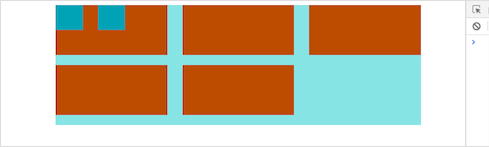

*you can add padding too, ```lost-center: 80% 40px;```*

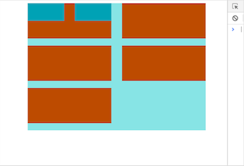


## Centering Divs

### Making a container using 'lost-center'

'lost-center' is essentailly just a container element

replace:
```css
.grid-one {
  width: 100%;
  lost-utility: clearfix;
}
```

with:
```css
.grid-one {
  width: 100%;
  lost-center: 80%;
  background: #9AE1E3;
}
```

The percentage of ```lost-center``` will center the grid with the correct margins
  * it's very helpful to build a container with
    * you can see the container is that background color you applied to ```.grid-one```


### Centering Items

***index.html***

Add some ```<h2>text</h2>``` to your ```grid-items```

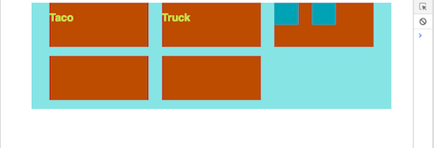

***styles.css***

To align the text in the middle-center of the div:
```css
.grid-one div h2 {
  color: #D0DC67;
  font-family: Sans-serif;
  margin: 0;
}
```

*make sure to give it a margin of zero so that it ignores the margins that the parent tries to pass along and the text will be centered correctly*

```css
.grid-one div {
  lost-column: 1/1;
  lost-align: center;
}
```

*add the ```lost-align: center;``` property to the parent*


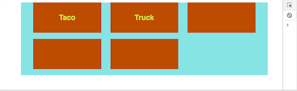


Just by including one line of code, ```lost-align: center;``` we can center content easily

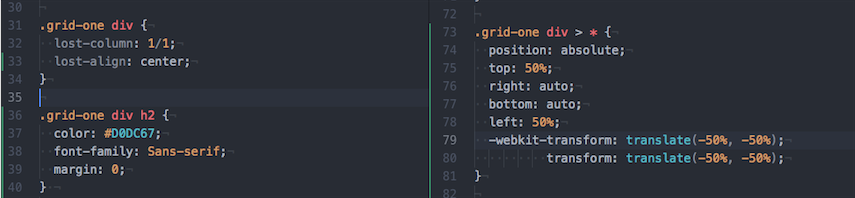


*Special thanks to LevelUp's [PostCSS Tutorials](https://www.youtube.com/watch?v=fMg5HlHmGLY&list=PLLnpHn493BHFvjZzyYrQP0RTsG-Al7j9m&index=1)*
